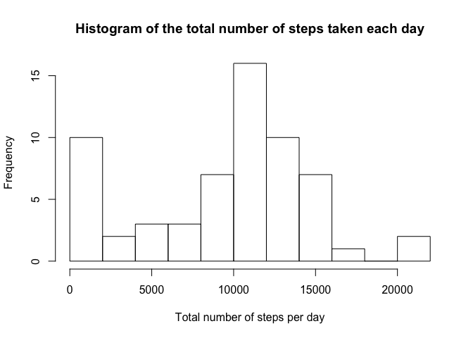
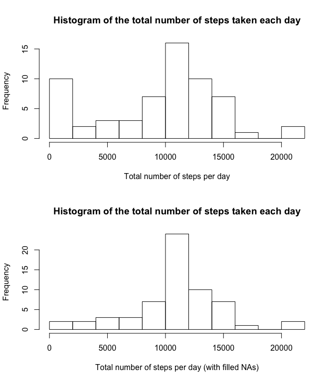
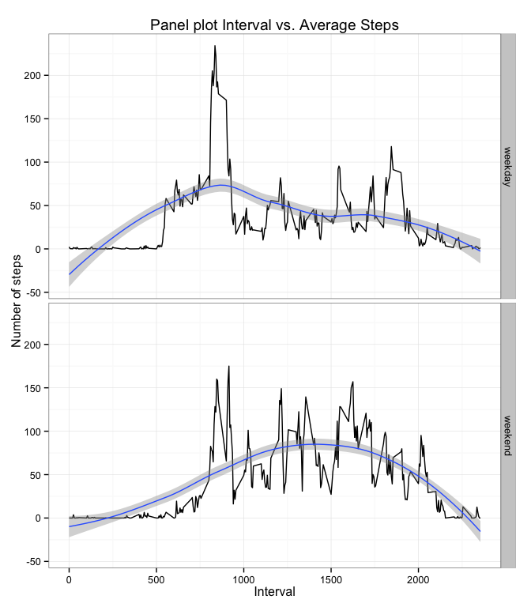

# Reproducible Research: Peer Assessment 1


## Loading and preprocessing the data

The repository contains data compressed as a zip file. First of all, the file is extracted using the `unzip` command. After that, the dataset is stored in the variable `actData` using the `read.csv` instruction.


```r
library(utils);
unzip("activity.zip");
actData <- read.csv("activity.csv");
```

After loading the data let's take a look at its structure


```r
str(actData);
```

```
## 'data.frame':	17568 obs. of  3 variables:
##  $ steps   : int  NA NA NA NA NA NA NA NA NA NA ...
##  $ date    : Factor w/ 61 levels "2012-10-01","2012-10-02",..: 1 1 1 1 1 1 1 1 1 1 ...
##  $ interval: int  0 5 10 15 20 25 30 35 40 45 ...
```

```r
head(actData);
```

```
##   steps       date interval
## 1    NA 2012-10-01        0
## 2    NA 2012-10-01        5
## 3    NA 2012-10-01       10
## 4    NA 2012-10-01       15
## 5    NA 2012-10-01       20
## 6    NA 2012-10-01       25
```

As we can see, the `date` column is classified as a *Factor*. In order to make it a *Date* variable let's execute this command and see the results: 


```r
actData$date <- as.Date(actData$date, '%Y-%m-%d');
```

```r
str(actData);
```

```
## 'data.frame':	17568 obs. of  3 variables:
##  $ steps   : int  NA NA NA NA NA NA NA NA NA NA ...
##  $ date    : Date, format: "2012-10-01" "2012-10-01" ...
##  $ interval: int  0 5 10 15 20 25 30 35 40 45 ...
```

```r
head(actData);
```

```
##   steps       date interval
## 1    NA 2012-10-01        0
## 2    NA 2012-10-01        5
## 3    NA 2012-10-01       10
## 4    NA 2012-10-01       15
## 5    NA 2012-10-01       20
## 6    NA 2012-10-01       25
```

## What is mean total number of steps taken per day?

For this part of the assignment, you can ignore the missing values in the dataset.

1. Calculate the total number of steps taken per day


```r
library(plyr)
totalStepsPerDay <- ddply(actData, ~ date, summarise, 
                          total_steps = sum(steps, na.rm = TRUE));
head(totalStepsPerDay);
```

```
##         date total_steps
## 1 2012-10-01           0
## 2 2012-10-02         126
## 3 2012-10-03       11352
## 4 2012-10-04       12116
## 5 2012-10-05       13294
## 6 2012-10-06       15420
```


2. If you do not understand the difference between a histogram and a barplot, research the difference between them. Make a histogram of the total number of steps taken each day


```r
hist(totalStepsPerDay$total_steps, breaks=10,
     main = 'Histogram of the total number of steps taken each day',
     xlab = 'Total number of steps per day'
);
```

 

3. Calculate and report the mean and median of the total number of steps taken per day

It is not needed to remove `NA`s since they have been released in the `ddply(...)` command. 

```r
meanTotSteps <- mean(totalStepsPerDay$total_steps);
medianTotSteps <- median(totalStepsPerDay$total_steps); 
```

The mean is $9354.2295082$ and the median is $10395$ of the total numer of steps taken per day.


## What is the average daily activity pattern?

1. Make a time series plot (i.e. `type = "l"`) of the 5-minute interval (x-axis) and the average number of steps taken, averaged across all days (y-axis)

First let's calculate the average number of steps taken in every 5-minute interval for all days. 


```r
avgStepsPerInterval <- ddply(actData, ~ interval, summarise, 
                             avg_steps = mean(steps, na.rm = TRUE));
head(avgStepsPerInterval);
```

```
##   interval avg_steps
## 1        0 1.7169811
## 2        5 0.3396226
## 3       10 0.1320755
## 4       15 0.1509434
## 5       20 0.0754717
## 6       25 2.0943396
```

The obtained data set's length is 288 which corresponds to: 
$$\frac{\frac{60\ min}{1\ hour} \cdot \frac{24\ hour}{1\ day}}{5\ min\ interval} = 288\ intervals\ per\ day$$

2. Which 5-minute interval, on average across all the days in the dataset, contains the maximum number of steps?


```r
max_i <- which.max(avgStepsPerInterval$avg_steps);
maxSteps <- avgStepsPerInterval[max_i, ];
```

The interval $835$ is the one with the maximum number of steps in average with a value of $206.1698113$.

## Imputing missing values

Note that there are a number of days/intervals where there are missing values (coded as `NA`). The presence of missing days may introduce bias into some calculations or summaries of the data.

1. Calculate and report the total number of missing values in the dataset (i.e. the total number of rows with `NA`s)

The function `is.na(...)` returns a vector of boolean values. Taking profit of this, we can sum up all the values and automatically `true` will be counted as 1 and `false` as 0, so counting the total number of missing values in the dataset. 


```r
sum(is.na(actData$steps));
```

```
## [1] 2304
```

2. Devise a strategy for filling in all of the missing values in the dataset. The strategy does not need to be sophisticated. For example, you could use the mean/median for that day, or the mean for that 5-minute interval, etc.

I define the strategy using a function to process one single row. In this case, I choose filling `NA` values with the **average for the specific 5-minute interval**.


```r
fillRowWithAvgInterval <- function(row){
    if (is.na(row$steps)){ # If steps is NA, search a value to fill in.
        indexRow <- avgStepsPerInterval$interval == row$interval;
        avgSteps <- avgStepsPerInterval[indexRow,];
        row$steps <- avgSteps$avg_steps;
    }
    row; # Return the row, whether it has been modified or not. 
}
```

3. Create a new dataset that is equal to the original dataset but with the missing data filled in.

Using the previous `fillRowWithAvgInterval` function I duplicate the original dataset `actData` into the `actDataFill` dataset and apply the function to every single row. 

```r
actDataFill <- actData;
for (i in 1:nrow(actDataFill)){
    actDataFill[i,] <- fillRowWithAvgInterval(actDataFill[i,]);
}
```

```r
head(actData);
```

```
##   steps       date interval
## 1    NA 2012-10-01        0
## 2    NA 2012-10-01        5
## 3    NA 2012-10-01       10
## 4    NA 2012-10-01       15
## 5    NA 2012-10-01       20
## 6    NA 2012-10-01       25
```

```r
head(actDataFill);
```

```
##       steps       date interval
## 1 1.7169811 2012-10-01        0
## 2 0.3396226 2012-10-01        5
## 3 0.1320755 2012-10-01       10
## 4 0.1509434 2012-10-01       15
## 5 0.0754717 2012-10-01       20
## 6 2.0943396 2012-10-01       25
```

4. Make a histogram of the total number of steps taken each day and Calculate and report the mean and median total number of steps taken per day. Do these values differ from the estimates from the first part of the assignment? What is the impact of imputing missing data on the estimates of the total daily number of steps?

First of all, let's compute the new dataset of the total number of steps per day using the `NA`-filled dataset. 


```r
totalStepsPerDayFill <- ddply(actDataFill, ~ date, summarise, 
                              total_steps = sum(steps, na.rm = TRUE));
head(totalStepsPerDayFill);
```

```
##         date total_steps
## 1 2012-10-01    10766.19
## 2 2012-10-02      126.00
## 3 2012-10-03    11352.00
## 4 2012-10-04    12116.00
## 5 2012-10-05    13294.00
## 6 2012-10-06    15420.00
```


```r
meanTotStepsFill <- mean(totalStepsPerDayFill$total_steps);
medianTotStepsFill <- median(totalStepsPerDayFill$total_steps); 
```

The mean of the dataset without taking into account `NA` is $9354.2295082$ and the median is $10395$ of the total numer of steps taken per day. On the other hand, the mean of the dataset with filled `NA`s is $1.0766189\times 10^{4}$ and the median is $1.0766189\times 10^{4}$. 

Comparing the previous histogram with the new one *(with filled NAs)* it is possible to see that **many zero occurences have passed to the central mean bar** (from a maximum frequency of 15 to a new maximum of 20). 


```r
hist(totalStepsPerDay$total_steps, breaks=10,
     main = 'Histogram of the total number of steps taken each day',
     xlab = 'Total number of steps per day'
);
hist(totalStepsPerDayFill$total_steps, breaks=10,
     main = 'Histogram of the total number of steps taken each day',
     xlab = 'Total number of steps per day (with filled NAs)'
);
```

 

## Are there differences in activity patterns between weekdays and weekends?

For this part the `weekdays()` function may be of some help here. Use the dataset with the filled-in missing values for this part.

1. Create a new factor variable in the dataset with two levels – “weekday” and “weekend” indicating whether a given date is a weekday or weekend day.

First of all, in order to identify weekend days using `weekdays()` the proper locale has to be defined. In my case default locale is Spanish, so I change it to English.


```r
Sys.setlocale("LC_TIME", "en_US");
```

```
## [1] "en_US"
```

```r
weekdays(Sys.Date()+0:6);
```

```
## [1] "Sunday"    "Monday"    "Tuesday"   "Wednesday" "Thursday"  "Friday"   
## [7] "Saturday"
```

To create the factor values I will use the following function.


```r
getDayType <- function(date){
    dayType <- "weekday";
    if (weekdays(date) %in% c("Saturday", "Sunday")){
        dayType <- "weekend";
    }
    dayType;
}
```

Now I create the new factor variable in the `actData` dataset.


```r
actData$day.type <- as.factor(sapply(actData$date, getDayType));
str(actData);
```

```
## 'data.frame':	17568 obs. of  4 variables:
##  $ steps   : int  NA NA NA NA NA NA NA NA NA NA ...
##  $ date    : Date, format: "2012-10-01" "2012-10-01" ...
##  $ interval: int  0 5 10 15 20 25 30 35 40 45 ...
##  $ day.type: Factor w/ 2 levels "weekday","weekend": 1 1 1 1 1 1 1 1 1 1 ...
```

2. Make a panel plot containing a time series plot (i.e. `type = "l"`) of the 5-minute interval (x-axis) and the average number of steps taken, averaged across all weekday days or weekend days (y-axis). See the README file in the GitHub repository to see an example of what this plot should look like using simulated data.

After plotting, let's build a dataset with the information needed for the plot, using the modified `actData` dataset and **ignoring the `NA` rows**.


```r
avgStepsPerIntervalAndDayType <- ddply(actData, ~ interval * day.type, summarise, 
                             avg_steps = mean(steps, na.rm = TRUE));
head(avgStepsPerIntervalAndDayType);
```

```
##   interval day.type avg_steps
## 1        0  weekday 2.3333333
## 2        0  weekend 0.0000000
## 3        5  weekday 0.4615385
## 4        5  weekend 0.0000000
## 5       10  weekday 0.1794872
## 6       10  weekend 0.0000000
```

Now we plot the data using the `ggplot2` package. 


```r
library(ggplot2)
g <- ggplot(avgStepsPerIntervalAndDayType, aes(interval, avg_steps));
q <- g + xlab("Interval") + ylab("Number of steps");         # Titles
q <- q + ggtitle("Panel plot Interval vs. Average Steps"); 
q <- q + geom_line() + facet_grid(day.type ~ .);      # Data and Split
q <- q + geom_smooth(method=loess);                   # Smooth overlay
q <- q + theme_bw();
print(q);
```

 

Answering the general question *Are there differences in activity patterns between weekdays and weekends?*; yes, there seems to be a higher amount of steps in the **afternoon of weekends**, between 12:00 and 17:00. On the contrary, there is a large pick of steps in the **morning of weekdays** at around 7:00 - 9:00. 
